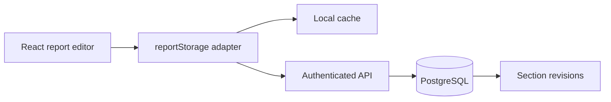

# Database architecture — Report Outline

## Keputusan arsitektur

Editor berjalan pada GitHub Pages, sehingga versi awal memakai `localStorage`
agar langsung dapat digunakan tanpa akun dan tanpa menyimpan secret di browser.
Komponen UI tidak mengakses vendor database secara langsung. Seluruh operasi
melewati `src/reportStorage.js`, yang dapat dialihkan ke backend dengan mengisi:

```env
VITE_REPORT_API_URL=https://api.example.com
```

Pendekatan produksi yang direkomendasikan adalah **PostgreSQL + authentication +
Row Level Security (RLS)**. Supabase merupakan pilihan praktis karena menyediakan
PostgreSQL, Auth, REST API, dan Realtime dalam satu layanan. RLS tetap wajib;
service-role/secret key tidak boleh dimasukkan ke Vite atau GitHub Pages.

## Alur data



- Local cache memberi autosave dan fallback ketika jaringan gagal.
- API memvalidasi pengguna dan payload serta menerapkan optimistic concurrency.
- Satu record `report_sections` menyimpan keadaan terbaru tiap bagian.
- Trigger menulis salinan perubahan ke `report_section_revisions` sebagai audit trail.

## Kontrak REST minimum

### `GET /reports/:slug`

Mengembalikan snapshot yang sesuai dengan kontrak frontend:

```json
{
  "reportId": "quantum-banking-readiness",
  "outlineVersion": 1,
  "savedAt": "2026-09-22T10:00:00.000Z",
  "sections": {
    "1-pendahuluan": {
      "content": "<p>...</p>",
      "status": "draft",
      "revision": 3
    }
  }
}
```

### `PUT /reports/:slug`

- Wajib membutuhkan session pengguna.
- Validasi ukuran payload, `status`, dan HTML yang diizinkan di server.
- Tolak update usang menggunakan `revision`/`If-Match` dengan status `409`.
- Jangan mempercayai HTML yang sudah dibersihkan oleh browser; sanitasi ulang di server.

## Model data

Migration awal tersedia di [`database/001_report_workspace.sql`](../database/001_report_workspace.sql).

| Tabel | Tanggung jawab |
| --- | --- |
| `reports` | Metadata dokumen dan owner |
| `report_collaborators` | Hak akses editor/reviewer/viewer |
| `report_sections` | Isi terbaru, status, urutan, dan nomor revisi |
| `report_section_revisions` | Riwayat immutable untuk audit dan pemulihan |

## Tahapan implementasi

1. **Saat ini:** local-first editor, autosave, status bagian, dan export JSON.
2. **Backend MVP:** Auth, endpoint GET/PUT, migration SQL, RLS, dan server-side sanitizer.
3. **Kolaborasi:** optimistic locking, komentar, presence, dan Realtime/Broadcast.
4. **Governance:** retention policy, backup, audit export, dan recovery test.

## Kontrol keamanan

- Gunakan hanya public/anon key di browser; simpan secret/service-role di server.
- Aktifkan RLS dan prinsip default-deny untuk seluruh tabel dokumen.
- Terapkan Content Security Policy dan sanitasi HTML di server.
- Catat siapa, kapan, dan revisi apa yang berubah.
- Enkripsi transport dengan TLS serta aktifkan backup dan uji pemulihan.
- Hindari memasukkan data bank/nasabah yang sensitif sebelum klasifikasi data,
  persetujuan organisasi, lokasi pemrosesan, dan kontrol vendor diselesaikan.

## Referensi resmi

- [Supabase Row Level Security](https://supabase.com/docs/guides/database/postgres/row-level-security)
- [Supabase Auth](https://supabase.com/docs/guides/auth)
- [Supabase Realtime database changes](https://supabase.com/docs/guides/realtime/subscribing-to-database-changes)
- [PostgreSQL Row Security Policies](https://www.postgresql.org/docs/current/ddl-rowsecurity.html)

